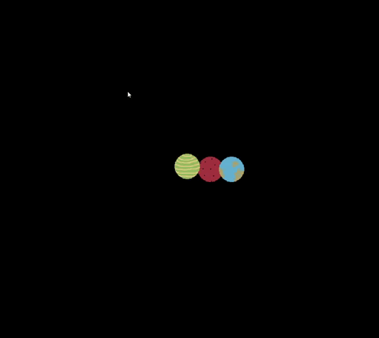

# Simulador de gravitação 

O programa calcula as forças entre cada corpo (planeta) levando em conta as massas e velocidades a cada frame  de modo que a movimentação simulada siga as leis da gravitação de Newton !!! 

## Screenshots

